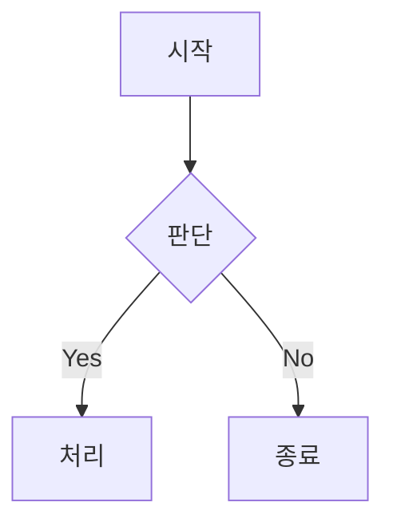

# sr-obsidian:obsidian-markdown — Obsidian 마크다운 참조

Obsidian Flavored Markdown 문법 레퍼런스. CommonMark/GFM 기본 문법은 가정 지식으로 생략.
Obsidian 특화 확장만 기술한다.

## 내부 링크 (Wikilink)

```markdown
[[노트 제목]]                      기본 링크
[[노트 제목|표시 텍스트]]           별칭 표시
[[노트 제목#헤딩]]                  헤딩 링크
[[노트 제목#^block-id]]             블록 링크
[[#같은 노트 헤딩]]                 동일 파일 내 헤딩
```

블록 ID 정의 — 단락 끝에 `^id` 추가:
```markdown
이 단락에 링크할 수 있다. ^my-block

- 목록 항목

^list-id
```

> 내부 링크는 `[[wikilink]]`, 외부 URL은 `[text](url)` 사용. Obsidian이 파일 이름 변경 시 wikilink를 자동 갱신한다.

## 임베드

```markdown
![[노트 제목]]                      노트 전체 임베드
![[노트 제목#헤딩]]                  섹션 임베드
![[이미지.png]]                     이미지
![[이미지.png|300]]                 너비 지정
![[문서.pdf#page=3]]                PDF 특정 페이지
```

전체 임베드 타입 → [EMBEDS.md](EMBEDS.md)

## 콜아웃

```markdown
> [!note]
> 기본 콜아웃.

> [!warning] 커스텀 제목
> 제목 지정 가능.

> [!faq]- 기본 접힘
> `-`는 접힘, `+`는 펼침.
```

지원 타입: `note`, `tip`, `warning`, `info`, `example`, `quote`, `bug`, `danger`, `success`, `failure`, `question`, `abstract`, `todo`

전체 타입 + 별칭 → [CALLOUTS.md](CALLOUTS.md)

## Properties (Frontmatter)

```yaml
---
type: permanent
created: 2025-05-08
tags:
  - tech
  - backend
aliases:
  - 대체 이름
cssclasses:
  - wide-page
status: active
---
```

sr-labs 공통 `type` 값: `fleeting`, `permanent`, `literature`, `daily`, `weekly`, `retro`, `issue`, `incident-step`, `wbs`, `wbs-step`, `meeting`, `diagram`, `adr`, `config`

전체 property 타입 → [PROPERTIES.md](PROPERTIES.md)

## 태그

```markdown
#태그
#중첩/태그
#kebab-tag
```

영문·숫자(첫 글자 제외)·밑줄·하이픈·슬래시 허용. frontmatter `tags:` 필드에도 정의 가능.

## 주석

```markdown
보이는 텍스트 %%숨겨진 텍스트%% 계속.

%%
여러 줄 주석 블록.
읽기 뷰에서 보이지 않는다.
%%
```

## 하이라이트

```markdown
==강조 텍스트==
```

## Dataview / DataviewJS

sr-labs vault에서 동적 테이블·목록 생성에 사용:

````markdown
```dataview
TABLE type, created FROM "20-areas/payment"
WHERE type = "permanent"
SORT created DESC
```
````

````markdown
```dataviewjs
const pages = dv.pages('"10-projects"').where(p => p.status === "in-progress");
dv.table(["이슈", "상태"], pages.map(p => [p.file.link, p.status]));
```
````

## Mermaid 다이어그램

````markdown

````

Obsidian 노트에 내부 링크로 연결: `class NodeName internal-link;`

## Math (LaTeX)

```markdown
인라인: $e^{i\pi} + 1 = 0$

블록:
$$
\frac{a}{b} = c
$$
```

## 각주

```markdown
본문[^1].

[^1]: 각주 내용.

인라인 각주.^[인라인으로 바로 작성.]
```

## 완성 예시

```markdown
---
type: permanent
created: 2025-05-08
tags:
  - tech
  - payment
status: active
---

# 결제 처리 흐름

[[PSP 개요]]에서 설명한 파이프라인을 기반으로 한다.

> [!important] 핵심 제약
> ==결제 완료 이벤트==는 멱등성이 보장되어야 한다.

## 처리 단계

- [x] 요청 수신
- [ ] 검증
  - [ ] 금액 범위 확인
  - [ ] 중복 거래 검사

![[결제 흐름 다이어그램.png|600]]

관련: [[ISS-042 결제 오류 인시던트#원인 분석]]
```

## 참조

- [Obsidian Flavored Markdown](https://help.obsidian.md/obsidian-flavored-markdown)
- [Internal links](https://help.obsidian.md/links)
- [Embeds](https://help.obsidian.md/embeds)
- [Callouts](https://help.obsidian.md/callouts)
- [Properties](https://help.obsidian.md/properties)
