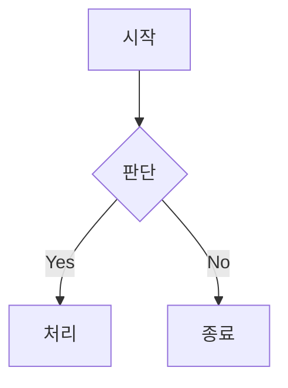

# sr-obsidian:obsidian-markdown — Obsidian 마크다운 참조

Obsidian Flavored Markdown 문법 레퍼런스. CommonMark/GFM 기본 문법은 가정 지식으로 생략.
Obsidian 특화 확장만 기술한다.

## 내부 링크 (Wikilink)

```markdown
[[파일명]]                          기본 링크 (파일명은 .md 제외)
[[파일명|표시 텍스트]]               표시 텍스트 지정
[[폴더/경로/파일명|표시 텍스트]]      경로형 (같은 파일명이 여럿일 때)
[[파일명#헤딩]]                     헤딩 링크
[[파일명#^block-id]]                블록 링크
[[#같은 노트 헤딩]]                 동일 파일 내 헤딩
| [[파일명\|표시 텍스트]] |          표 셀 안 (파이프 이스케이프)
```

블록 ID 정의 — 단락 끝에 `^id` 추가:
```markdown
이 단락에 링크할 수 있다. ^my-block

- 목록 항목

^list-id
```

> 내부 링크는 `[[wikilink]]`, 외부 URL은 `[text](url)` 사용. Obsidian이 파일 이름 변경 시 wikilink를 자동 갱신한다.

### 링크 대상 규칙 (#8607 D6)

sr-labs vault에 노트를 쓰거나 고치는 스킬은 모두 이 규칙을 따릅니다.

- 링크 대상은 **실제 파일명(`.md` 제외) 또는 vault 기준 경로**입니다. Obsidian은 H1 제목이나 frontmatter `aliases`로 링크를 해석하지 않아요. `aliases`는 자동완성과 검색에만 쓰입니다.
- 파일명과 보여줄 이름이 다르면 `[[파일명|표시 텍스트]]`로 씁니다. 예를 들어 `50-moc/tech-moc.md`의 H1은 `Tech MOC`라서 `[[tech-moc|Tech MOC]]`로 걸어요. `[[Tech MOC]]`는 미해소입니다.
- 같은 파일명이 vault에 둘 이상이면 경로형으로 씁니다. 날짜 파일명(`2026-09-24.md`)은 데일리 노트와 radar 로그가 겹치니 경로형이 기본이에요.
- 표 셀 안의 `|`는 `\|`로 이스케이프합니다. 이스케이프하지 않으면 표 구분자로 읽혀 링크로 색인되지 않아요.
- 존재하지 않는 노트에 `[[ ]]`를 미리 걸지 않습니다(선행 링크 금지). 앞으로 만들 후보는 평문으로 적어요.
- `60-logs` 기록에서 대상이 사라진 과거 링크는 당시 기록으로 두고 고치지 않습니다.

### 링크 해소 확인

radar, wiki처럼 노트에 링크를 쓰는 스킬은 커밋 전에 이번에 넣은 링크가 모두 해소되는지 이 스크립트로 확인합니다. 기존 파일은 HEAD 대비 추가된 줄만, 새 파일은 전체를 봐요. 과거 줄에 남은 미해소 링크는 이 확인의 대상이 아닙니다. 파일은 절대 경로로 넘깁니다.

```bash
python3 - "${VAULT:-/Users/sr/obsidian/sr-labs}" {이번에 쓰거나 고친 파일의 절대 경로...} <<'PY'
import os, posixpath, re, subprocess, sys, unicodedata
from collections import Counter
argv = sys.argv[1:]
no_git = "--no-git" in argv
argv = [a for a in argv if a != "--no-git"]
def unable(msgs):  # 검증하지 못한 것을 미해소와 구분한다
    for m in msgs:
        print(f"검증 불가: {m}")
    sys.exit(2)
vault = argv[0] if argv else ""
if not vault or not os.path.isdir(os.path.join(vault, ".obsidian")):
    unable([f"vault 경로가 아님 ({vault or '인자 없음'})"])
vault = os.path.realpath(vault)
def git(*a):
    return subprocess.run(["git", "-C", vault, *a], capture_output=True, text=True, encoding="utf-8", errors="replace")
if not no_git:
    try:
        if git("rev-parse", "--is-inside-work-tree").returncode:
            unable([f"git 저장소가 아님 ({vault}). git 없이 확인하려면 --no-git"])
    except FileNotFoundError:
        unable(["git 명령 없음. git 없이 확인하려면 --no-git"])
targets, errs = [], []
for a in argv[1:]:  # 인자는 파일 경로. "경로:시작줄"(파일 끝까지)이나 "경로:시작줄-끝줄"로 범위를 좁힐 수 있다
    f, lo, hi, m = a, 1, None, re.match(r"^(.*):(\d+)(?:-(\d+))?$", a)
    if not os.path.isfile(a) and m and os.path.isfile(m.group(1)):
        f, lo, hi = m.group(1), int(m.group(2)), int(m.group(3)) if m.group(3) else None
    rel = unicodedata.normalize("NFC", os.path.relpath(os.path.realpath(f), vault))
    if not os.path.isfile(f):
        errs.append(f"파일 없음 ({a})")
    elif rel.startswith(".."):
        errs.append(f"vault 밖 파일 ({a})")
    else:
        targets.append((os.path.realpath(f), rel, lo, hi))
if errs or not targets:
    unable(errs or ["검사할 파일 인자 없음"])
norm = lambda s: unicodedata.normalize("NFC", s).lower()
md_paths, md_stems, all_paths, all_names = set(), Counter(), set(), Counter()
for root, dirs, names in os.walk(vault):  # .md 와 첨부를 모두 색인한다
    dirs[:] = [d for d in dirs if not d.startswith(".") and d not in ("_backups", "node_modules")]
    for name in names:
        if name.startswith("."):
            continue
        p = norm(os.path.relpath(os.path.join(root, name), vault))
        all_paths.add(p); all_names[norm(name)] += 1
        if p.endswith(".md"):
            md_paths.add(p[:-3]); md_stems[norm(name[:-3])] += 1
def resolve(t):  # ok | 모호(경로형 필요) | 미해소
    for paths, names, key in ((md_paths, md_stems, t[:-3] if t.endswith(".md") else t), (all_paths, all_names, t)):
        if "/" in key:
            n = 1 if key in paths else sum(p.endswith("/" + key) for p in paths)
        else:
            n = names[key]
        if n:
            return "ok" if n == 1 else "모호(경로형 필요)"
    return "미해소"
FENCE = re.compile(r"^((?:\s{0,3}>)*)\s{0,3}(`{3,}|~{3,})(.*)$")
def code_lines(lines):  # fence 안 줄 번호. vault _scripts/vault-review.py strip_fences 와 같은 규칙
    start, out, open_ = 0, set(), None
    if lines and lines[0].rstrip() == "---":  # frontmatter 는 fence 판정에서 뺀다
        start = next((j + 1 for j in range(1, len(lines)) if lines[j].startswith("---")), 0)
    for i in range(start, len(lines)):
        m = FENCE.match(lines[i])
        if open_ is None:
            if m and not (m.group(2)[0] == "`" and "`" in m.group(3)):
                open_ = (m.group(1).count(">"), m.group(2)[0], len(m.group(2))); out.add(i + 1)
        else:
            if (m and m.group(1).count(">") == open_[0] and m.group(2)[0] == open_[1]
                    and len(m.group(2)) >= open_[2] and not m.group(3).strip()):
                open_ = None
            out.add(i + 1)
    return out
def added(f, n):  # 검사할 줄 번호. 기존 파일은 HEAD 대비 추가된 줄, 새 파일과 --no-git 은 전체
    if no_git or git("ls-files", "--error-unmatch", "--", f).returncode:
        return set(range(1, n + 1))
    d = git("diff", "--no-color", "--no-ext-diff", "-U0", "HEAD", "--", f)
    if d.returncode:
        unable([f"git diff 실패 ({f}): {d.stderr.strip()[:120]}"])
    out, cur = set(), None
    for l in d.stdout.split("\n"):
        h = re.match(r"^@@ -\d+(?:,\d+)? \+(\d+)(?:,\d+)? @@", l)
        if h:
            cur = int(h.group(1))
        elif cur is not None and l.startswith("+"):
            out.add(cur); cur += 1
        elif cur is not None and l.startswith(" "):
            cur += 1
    return out
bad = 0
for f, rel, lo, hi in targets:
    lines = open(f, encoding="utf-8", errors="replace").read().split("\n")
    code, hi = code_lines(lines), hi or len(lines)
    for no in sorted(n for n in added(f, len(lines)) - code if lo <= n <= hi and n <= len(lines)):
        line = re.sub(r"`[^`]*`", "", lines[no - 1])  # 인라인 코드 안의 [[ ]] 는 링크가 아니다
        if line.lstrip().startswith("|") and re.search(r"\[\[[^\]]*(?<!\\)\|", line):
            bad += 1; print(f"표 안 파이프 미이스케이프: {rel}:{no}: {line.strip()[:80]}")
        for m in re.finditer(r"\[\[([^\[\]]*)\]\]", line):
            raw = m.group(1)
            if raw.startswith("#"):
                continue  # 같은 노트 안 헤딩 링크
            t = re.split(r"\\?\||#", raw)[0].strip().replace("\\", "/")
            if t.startswith(("./", "../")):
                t = posixpath.normpath(posixpath.join(posixpath.dirname(rel), t))
                while t.startswith("../"):
                    t = t[3:]  # vault 루트 위로 넘치는 ../ 는 루트에서 멈춘다
            t = norm(t.lstrip("/"))
            verdict = resolve(t) if t else "빈 링크"
            if verdict != "ok":
                bad += 1; print(f"{verdict}: {rel}:{no} -> [[{raw}]]")
print(f"미해소 {bad}건")
sys.exit(1 if bad else 0)
PY
```

- **통과**: `미해소 0건`과 exit 0이 나와야 해요. 문제가 있으면 줄마다 `미해소`, `모호(경로형 필요)`, `빈 링크`, `표 안 파이프 미이스케이프` 가운데 하나와 `파일:줄`을 찍고 exit 1로 끝납니다. 대상 노트의 실제 파일명으로 고치거나(`[[파일명|표시 텍스트]]`), 대상이 없으면 평문으로 바꾼 뒤 다시 돌려요.
- **검증 불가**: `검증 불가:`로 시작하는 줄과 exit 2는 링크 문제가 아니라 확인 자체를 못 했다는 뜻입니다. vault 경로(`.obsidian` 폴더가 있는 루트), git 저장소 여부, 파일 경로를 바로잡고 다시 돌리며, 노트는 고치지 않아요.
- **코드는 보지 않음**: 코드 fence 안(여닫는 줄 포함)과 인라인 코드 안의 `[[ ]]`는 링크가 아닙니다. bash의 `[[ -f "$X" ]]` 같은 조건식이 여기에 해당해요. fence 판정은 vault `_scripts/vault-review.py`의 `strip_fences`와 같습니다. 여는 fence의 인용 깊이, 문자, 길이를 기억해 같은 깊이, 같은 문자, 같거나 긴 길이이면서 info string이 없는 줄에서만 닫아요.
- **모호한 파일명은 실패**: 파일명만 쓴 대상(또는 경로 끝부분)이 vault에서 둘 이상과 맞으면, Obsidian이 그중 하나를 골라 열더라도 `모호(경로형 필요)`로 실패시킵니다. `[[폴더/경로/파일명|표시 텍스트]]`로 고쳐요.
- **첨부도 확인**: `.png`, `.xlsx`처럼 `.md`가 아닌 파일도 색인해 실재 여부를 봅니다.
- **git 없는 실행 환경**: Cowork처럼 git을 쓰지 않는 레인에서는 `--no-git`을 붙입니다. 인자로 준 파일의 전체 줄을 검사하고, `경로:시작줄`(파일 끝까지)이나 `경로:시작줄-끝줄`로 범위를 좁힐 수 있어요. 기존 파일 끝에 덧붙인 블록만 보려면 덧붙이기 전 줄 수에 1을 더한 값을 시작줄로 줍니다.

```bash
# 첫 줄만 이렇게 바꾸고, 스크립트 본문과 끝의 PY 는 위와 같다
python3 - --no-git "${VAULT:-/Users/sr/obsidian/sr-labs}" {새로 만든 파일의 절대 경로...} {덧붙인 파일의 절대 경로}:{시작줄} <<'PY'
```

해석 규칙은 vault `_scripts/vault-review.py`(#8608)의 Obsidian 해석 규칙을 줄인 것이고, 모호한 파일명을 실패로 치는 점만 더 엄격합니다.

## 임베드

```markdown
![[파일명]]                         노트 전체 임베드
![[파일명#헤딩]]                    섹션 임베드
![[이미지.png]]                     이미지
![[이미지.png|300]]                 너비 지정
![[문서.pdf#page=3]]                PDF 특정 페이지
```

전체 임베드 타입 → [EMBEDS.md](EMBEDS.md)

## 콜아웃

```markdown
> [!note]
> 기본 콜아웃.

> [!warning] 커스텀 제목
> 제목 지정 가능.

> [!faq]- 기본 접힘
> `-`는 접힘, `+`는 펼침.
```

지원 타입: `note`, `tip`, `warning`, `info`, `example`, `quote`, `bug`, `danger`, `success`, `failure`, `question`, `abstract`, `todo`

전체 타입 + 별칭 → [CALLOUTS.md](CALLOUTS.md)

## Properties (Frontmatter)

```yaml
---
type: permanent
created: 2025-05-08
tags:
  - tech
  - backend
aliases:
  - 대체 이름
cssclasses:
  - wide-page
status: active
---
```

sr-labs 공통 `type` 값: `fleeting`, `permanent`, `literature`, `daily`, `weekly`, `retro`, `issue`, `incident-step`, `wbs`, `wbs-step`, `meeting`, `diagram`, `adr`, `config`

전체 property 타입 → [PROPERTIES.md](PROPERTIES.md)

## 태그

```markdown
#태그
#중첩/태그
#kebab-tag
```

영문·숫자(첫 글자 제외)·밑줄·하이픈·슬래시 허용. frontmatter `tags:` 필드에도 정의 가능.

## 주석

```markdown
보이는 텍스트 %%숨겨진 텍스트%% 계속.

%%
여러 줄 주석 블록.
읽기 뷰에서 보이지 않는다.
%%
```

## 하이라이트

```markdown
==강조 텍스트==
```

## Dataview / DataviewJS

sr-labs vault에서 동적 테이블·목록 생성에 사용:

````markdown
```dataview
TABLE type, created FROM "20-areas/payment"
WHERE type = "permanent"
SORT created DESC
```
````

````markdown
```dataviewjs
const pages = dv.pages('"10-projects"').where(p => p.status === "in-progress");
dv.table(["이슈", "상태"], pages.map(p => [p.file.link, p.status]));
```
````

## Mermaid 다이어그램

````markdown

```mermaid
graph TD
    A[시작] --> B{판단}
    B -->|Yes| C[처리]
    B -->|No| D[종료]
```
````

Obsidian 노트에 내부 링크로 연결: `class NodeName internal-link;`

## Math (LaTeX)

```markdown
인라인: $e^{i\pi} + 1 = 0$

블록:
$$
\frac{a}{b} = c
$$
```

## 각주

```markdown
본문[^1].

[^1]: 각주 내용.

인라인 각주.^[인라인으로 바로 작성.]
```

## 완성 예시

```markdown
---
type: permanent
created: 2025-05-08
tags:
  - tech
  - payment
status: active
---

# 결제 처리 흐름

[[PSP 개요]]에서 설명한 파이프라인을 기반으로 한다.

> [!important] 핵심 제약
> ==결제 완료 이벤트==는 멱등성이 보장되어야 한다.

## 처리 단계

- [x] 요청 수신
- [ ] 검증
  - [ ] 금액 범위 확인
  - [ ] 중복 거래 검사

![[결제 흐름 다이어그램.png|600]]

관련: [[ISS-042 결제 오류 인시던트#원인 분석]]
```

## 참조

- [Obsidian Flavored Markdown](https://help.obsidian.md/obsidian-flavored-markdown)
- [Internal links](https://help.obsidian.md/links)
- [Embeds](https://help.obsidian.md/embeds)
- [Callouts](https://help.obsidian.md/callouts)
- [Properties](https://help.obsidian.md/properties)
